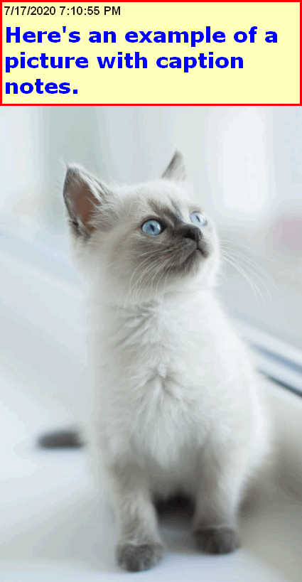

= PIC NOTES: `examples\pics`
:date: 14 November 2020 07:25PM
:toc:

NOTE: Entries sorted by base filename.

== screenshot-20200717191204.png
  - link:screenshot-20200717191204.png[window='_blank']  [[md5_abbe108cbcac7b53e2025ca8c3716c1a]] - This is a note that is part of the picture.
+
link:screenshot-20200717191204.png[  , window='_blank']

== screenshot-20200717191313.png
  - link:screenshot-20200717191313.png[window='_blank']  [[md5_e9c33dc2d379c36b2fe2f615d56bfb0d]] - Here's an example of a picture with caption notes.
+
link:screenshot-20200717191313.png[  , window='_blank']

== dogs\screenshot-20200717192744.png
  - link:dogs\screenshot-20200717192744.png[window='_blank']  [[md5_8159b9b6e12d58b6308d68958d71ec44]] - Here's a good boi.
+
link:dogs\screenshot-20200717192744.png[ image:dogs\screenshot-20200717192744.png[width=50%] , window='_blank']

== screenshot-20200718115314-lots_of_text.png
  - link:screenshot-20200718115314-lots_of_text.png[window='_blank']  [[md5_ebc5bdea4ff8417e5c2d2dcc68529ceb]] - This pic has lots of text but only this note will be scanned by the OCR engine.
+
link:screenshot-20200718115314-lots_of_text.png[ image:screenshot-20200718115314-lots_of_text.png[width=50%] , window='_blank']

